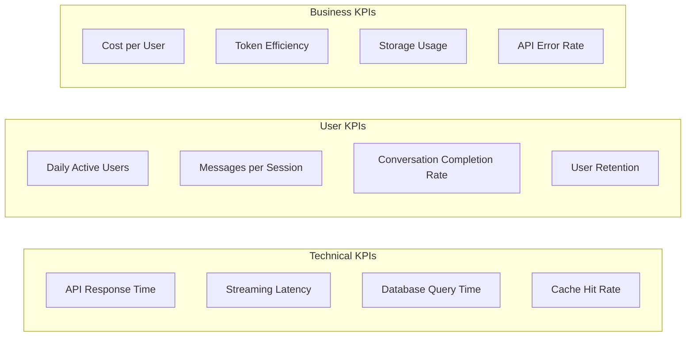
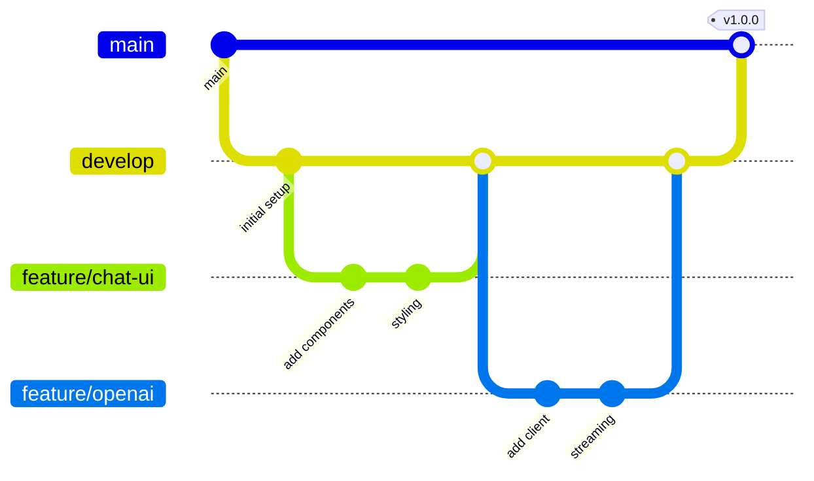

# MVP User Stories
## Workbench LLM Chat Application

---

## Overview

This document outlines the MVP (Minimum Viable Product) development phases for the Workbench LLM chat application. Each phase builds upon the previous one, delivering incremental value while maintaining a shippable product at each milestone.

## Phase 1: Core Chat Functionality (Week 1-2)

### Epic: Basic Chat Interface
**Goal**: Establish a working chat interface with LLM integration

#### User Stories

##### 1.1 Basic Chat UI
**As a** user  
**I want to** send messages in a chat interface  
**So that** I can interact with an AI assistant  

**Acceptance Criteria:**
- [ ] Chat interface displays with input field and send button
- [ ] Messages appear in conversation view with user/assistant distinction
- [ ] Markdown formatting is rendered correctly
- [ ] Code blocks have syntax highlighting
- [ ] Interface is responsive on mobile and desktop

**Technical Tasks:**
- Set up React project with TypeScript and Vite
- Install and configure assistant-ui components
- Implement basic chat layout with Tailwind CSS
- Add react-markdown with syntax highlighting
- Create message component with role-based styling

##### 1.2 OpenAI Integration
**As a** user  
**I want to** receive AI responses to my messages  
**So that** I can have meaningful conversations  

**Acceptance Criteria:**
- [ ] Backend connects to OpenAI API
- [ ] Messages are sent to GPT-4 model
- [ ] Responses are returned and displayed
- [ ] Error states are handled gracefully
- [ ] Loading state shows while waiting for response

**Technical Tasks:**
- Set up Axum backend with basic routing
- Integrate async-openai client
- Create `/api/chat` endpoint
- Implement error handling middleware
- Add environment variable configuration

##### 1.3 Message Persistence
**As a** user  
**I want to** have my conversations saved  
**So that** I can continue them later  

**Acceptance Criteria:**
- [ ] Messages are saved to PostgreSQL
- [ ] Conversations persist across page refreshes
- [ ] Database schema supports conversations and messages
- [ ] Timestamps are recorded for all messages
- [ ] Token usage is tracked per message

**Technical Tasks:**
- Set up PostgreSQL 17 connection with sqlx
- Create initial database migrations
- Implement message repository pattern
- Add conversation ID to frontend state
- Create data access layer

---

## Phase 2: User Management & Enhanced UX (Week 3-4)

### Epic: Multi-User Support
**Goal**: Add authentication and personal conversation management

#### User Stories

##### 2.1 User Authentication
**As a** user  
**I want to** create an account and log in  
**So that** my conversations are private and secure  

**Acceptance Criteria:**
- [ ] Registration page with email/password
- [ ] Login page with session management
- [ ] JWT tokens stored in HttpOnly cookies
- [ ] Logout functionality clears session
- [ ] Protected routes require authentication

**Technical Tasks:**
- Implement auth endpoints (register, login, logout)
- Add password hashing with Argon2
- Set up JWT token generation and validation
- Create auth middleware for protected routes
- Add Redis session storage with tower-sessions

##### 2.2 Conversation Management
**As a** user  
**I want to** manage multiple conversations  
**So that** I can organize different topics  

**Acceptance Criteria:**
- [ ] Sidebar shows list of conversations
- [ ] Can create new conversation
- [ ] Can switch between conversations
- [ ] Can rename conversations
- [ ] Can delete conversations

**Technical Tasks:**
- Create conversation list component
- Add conversation CRUD endpoints
- Implement conversation state management with Zustand
- Add conversation title generation from first message
- Create confirmation dialog for deletion

##### 2.3 Streaming Responses
**As a** user  
**I want to** see AI responses as they're generated  
**So that** I get faster feedback  

**Acceptance Criteria:**
- [ ] Responses stream token by token
- [ ] Smooth rendering without flicker
- [ ] Can stop generation mid-stream
- [ ] Partial responses are saved
- [ ] Connection errors are handled gracefully

**Technical Tasks:**
- Implement SSE endpoint for streaming
- Add EventSource client in React
- Use AI SDK's useChat hook
- Implement stream parsing and buffering
- Add abort controller for stopping

---

## Phase 3: Advanced Features (Week 5-6)

### Epic: Enhanced Capabilities
**Goal**: Support multiple AI providers and rich interactions

#### User Stories

##### 3.1 Multiple LLM Providers
**As a** user  
**I want to** choose between different AI models  
**So that** I can use the best model for my task  

**Acceptance Criteria:**
- [ ] Model selector in chat interface
- [ ] Support for OpenAI GPT-4 and GPT-3.5
- [ ] Support for Anthropic Claude models
- [ ] Model-specific parameters (temperature, max tokens)
- [ ] Per-conversation model selection

**Technical Tasks:**
- Add anthropic-rust integration
- Create model abstraction layer
- Implement model selector component
- Add model configuration to conversation metadata
- Update streaming to handle different providers

##### 3.2 File Attachments
**As a** user  
**I want to** attach files to my messages  
**So that** I can get help with documents and images  

**Acceptance Criteria:**
- [ ] Drag-and-drop file upload
- [ ] Support for images, PDFs, and text files
- [ ] Files stored on NAS at .103
- [ ] Preview for uploaded files
- [ ] File size limits enforced (10MB)

**Technical Tasks:**
- Create file upload endpoint
- Implement NFS storage integration
- Add file attachment UI component
- Create file preview modal
- Implement file type validation

##### 3.3 Conversation Branching
**As a** user  
**I want to** edit previous messages and explore alternatives  
**So that** I can try different conversation paths  

**Acceptance Criteria:**
- [ ] Can edit any user message
- [ ] Editing creates a new branch
- [ ] Can switch between branches
- [ ] Branch visualization in UI
- [ ] Original conversation preserved

**Technical Tasks:**
- Update database schema for parent-child relationships
- Implement tree data structure for messages
- Create branch switcher UI component
- Add message edit functionality
- Update message repository for branch queries

---

## Phase 4: Production Readiness (Week 7-8)

### Epic: Scale & Polish
**Goal**: Add enterprise features for production deployment

#### User Stories

##### 4.1 Semantic Search
**As a** user  
**I want to** search across all my conversations  
**So that** I can find previous discussions  

**Acceptance Criteria:**
- [ ] Search bar in application header
- [ ] Search returns relevant messages
- [ ] Results show conversation context
- [ ] Click to jump to conversation
- [ ] Search uses semantic similarity

**Technical Tasks:**
- Enable pgvector extension
- Generate embeddings for messages
- Create search endpoint with similarity query
- Implement search results component
- Add background job for embedding generation

##### 4.2 Usage Analytics
**As a** user  
**I want to** see my AI usage statistics  
**So that** I can track costs and usage patterns  

**Acceptance Criteria:**
- [ ] Dashboard shows token usage
- [ ] Cost breakdown by model
- [ ] Usage trends over time
- [ ] Export usage data as CSV
- [ ] Per-conversation token counts

**Technical Tasks:**
- Create analytics dashboard page
- Add usage aggregation queries
- Implement chart components with recharts
- Create CSV export endpoint
- Add cost calculation logic

##### 4.3 Rate Limiting
**As a** system administrator  
**I want to** limit API usage per user  
**So that** costs are controlled and system is protected  

**Acceptance Criteria:**
- [ ] Rate limits enforced per user
- [ ] Clear error messages when limited
- [ ] Headers show remaining quota
- [ ] Different limits for different user tiers
- [ ] Admin override capability

**Technical Tasks:**
- Integrate tower-governor middleware
- Add rate limit configuration
- Create rate limit error responses
- Add x-ratelimit headers
- Implement Redis-based counters

---

## Definition of Done

For each user story to be considered complete:

1. **Code Complete**
   - [ ] Feature implemented and working
   - [ ] Unit tests written (>80% coverage)
   - [ ] Integration tests for API endpoints
   - [ ] Code reviewed and approved

2. **Documentation**
   - [ ] API documentation updated
   - [ ] README updated if needed
   - [ ] Inline code comments added
   - [ ] Architecture decision recorded

3. **Quality Assurance**
   - [ ] Manual testing completed
   - [ ] No critical bugs remaining
   - [ ] Performance acceptable (<200ms response)
   - [ ] Security review passed

4. **Deployment Ready**
   - [ ] Database migrations tested
   - [ ] Environment variables documented
   - [ ] Systemd service files updated
   - [ ] Monitoring alerts configured

---

## Technical Debt & Future Enhancements

### Post-MVP Improvements

1. **Performance Optimizations**
   - Implement response caching
   - Add database connection pooling
   - Optimize embedding generation
   - Implement lazy loading for conversations

2. **Advanced Features**
   - Voice input/output
   - Real-time collaboration
   - Custom system prompts
   - Plugin architecture
   - RAG (Retrieval Augmented Generation)

3. **Infrastructure**
   - Automated backups to NAS
   - High availability setup
   - Load balancing across .101 and .105
   - Comprehensive monitoring with Grafana

4. **Security Enhancements**
   - Two-factor authentication
   - API key management
   - Audit logging
   - End-to-end encryption for sensitive data

---

## Success Metrics

### MVP Success Criteria

- **Performance**: 95th percentile response time < 500ms
- **Reliability**: 99.9% uptime
- **Scalability**: Support 100 concurrent users
- **User Experience**: Time to first message < 10 seconds
- **Cost Efficiency**: < $0.10 per conversation average

### Key Performance Indicators (KPIs)

---

## Risk Mitigation

### Identified Risks & Mitigations

| Risk | Probability | Impact | Mitigation |
|------|------------|--------|------------|
| OpenAI API Outage | Medium | High | Implement fallback to local models |
| Database Corruption | Low | Critical | Daily backups to NAS |
| Rate Limit Exceeded | High | Medium | Implement queueing system |
| NFS Mount Failure | Low | High | Local cache fallback |
| Memory Leak in Rust | Low | High | Monitoring and auto-restart |

---

## Development Workflow

### Git Branch Strategy

### Sprint Planning

- **Sprint Length**: 1 week
- **Story Points**: 1-8 scale
- **Velocity Target**: 20-30 points per sprint
- **Review Meeting**: End of each sprint
- **Retrospective**: After each phase

---

## Conclusion

This MVP plan provides a structured approach to building the Workbench LLM chat application. Each phase delivers working software that provides value, while building toward a comprehensive solution. The modular architecture and clear separation of concerns ensure that the application can evolve based on user feedback and changing requirements.