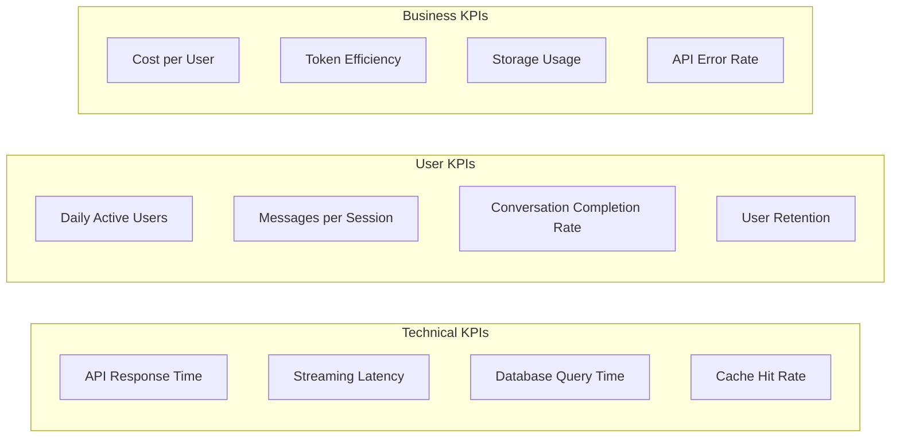
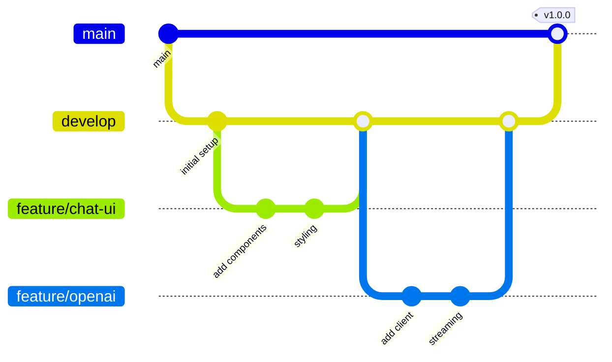

# Completed Stories

## UX Improvements

### UX-003 Frontend - Add Loading States - **COMPLETED**
**Completed by**: FRONTEND_SPECIALIST
**Date**: 2025-09-15
**Commit**: 25b6a08

**As a** user
**I want to** see loading indicators during async operations
**So that** I know the application is processing my request and can't accidentally double-submit

**Acceptance Criteria:** ALL COMPLETED
- ✅ Add loading spinners/skeletons during API calls
- ✅ Show loading state while authenticating
- ✅ Add loading indicators for message sending
- ✅ Implement progressive loading for large datasets
- ✅ Disable form submissions while processing

**Implementation:**
- Created comprehensive LoadingSpinner component suite with multiple variants, sizes, and accessibility features
- Implemented LoadingDots, Skeleton, ConversationSkeleton, and LoadingOverlay components
- Enhanced BranchingChat with branch operation loading states and improved streaming indicators
- Added skeleton loaders to ConversationSidebar for better perceived performance
- Updated ChatInput and Chat components with consistent loading states
- Added 30 comprehensive tests covering all loading components and accessibility features
- Ensured mobile-responsive design and smooth transitions

**Files Modified:**
- frontend/src/components/LoadingSpinner.tsx (NEW)
- frontend/src/components/BranchingChat.tsx
- frontend/src/components/Chat.tsx
- frontend/src/components/ChatInput.tsx
- frontend/src/components/ConversationSidebar.tsx
- frontend/tests/components/LoadingSpinner_test.tsx (NEW)

### AUTH-004 Frontend - Implement Auth State Management - **COMPLETED**
**Completed by**: FRONTEND_SPECIALIST
**Date**: 2025-09-15
**Commit**: a774e46

**As a** developer
**I want to** implement global authentication state management
**So that** the application can track user authentication status and protect routes consistently

**Acceptance Criteria:** ALL COMPLETED
- ✅ Create auth context/store for global auth state
- ✅ Track user login status, user info, and permissions
- ✅ Implement protected routes that require authentication
- ✅ Add auth guards for components requiring login
- ✅ Handle auth state persistence across sessions

**Implementation:**
- Created comprehensive AuthContext with React useReducer for state management
- Implemented login, register, logout, and checkAuth methods with proper error handling
- Added useAuth, usePermission, useUser, and useAuthState custom hooks for easy access
- Built ProtectedRoute component with authentication guards and fallback UI
- Enhanced App.tsx with AuthProvider and user interface elements
- Updated API client to use cookie-based authentication with credentials: 'include'
- Implemented permission system for role-based access control
- Added loading states and error handling for all auth operations
- Created comprehensive test suites (25 tests total) covering all functionality

**Architecture Benefits:**
- Cookie-based authentication for security (HttpOnly, Secure, SameSite)
- Automatic token validation on app load with session persistence
- Clean separation between auth context and UI components
- Comprehensive error handling and loading states
- Permission-based access control ready for future expansion
- Full TypeScript type safety across all auth operations

**Files Created/Modified:**
- frontend/src/contexts/AuthContext.tsx (NEW)
- frontend/src/hooks/useAuth.ts (NEW)
- frontend/src/components/ProtectedRoute.tsx (NEW)
- frontend/tests/contexts/AuthContext_test.tsx (NEW)
- frontend/tests/hooks/useAuth_test.ts (NEW)
- frontend/src/App.tsx (enhanced with auth UI)
- frontend/src/services/api.ts (updated for cookie auth)
- frontend/src/components/index.ts (added exports)

## Authentication System

### AUTH-002 Frontend - Implement Auth Token Storage - **COMPLETED**
**Completed by**: FRONTEND_SPECIALIST
**Date**: 2025-09-15
**Commit**: 45307de

**As a** developer
**I want to** securely store JWT tokens with automatic expiry handling
**So that** users can remain authenticated across browser sessions

**Acceptance Criteria:** ALL COMPLETED
- ✅ Store JWT tokens securely in localStorage or sessionStorage
- ✅ Implement token persistence across page refreshes
- ✅ Add token expiration handling
- ✅ Clear tokens on logout

**Implementation:**
- SecureStorage utility with localStorage/sessionStorage fallback and memory storage support
- AuthService class with comprehensive authentication lifecycle management
- Integration with existing API client for automatic auth header injection
- Support for both JWT tokens and HttpOnly cookie authentication patterns
- Comprehensive test coverage with 73 passing tests across storage and auth services
- Automatic token refresh scheduling with configurable timing
- Complete auth data cleanup on logout and token expiry

## Phase 4: Enterprise Features

### 4.1 Semantic Search - **COMPLETED**
**Completed by**: Agent-10
**Date**: 2025-09-14
**Commit**: c3254fa

**As a** user
**I want to** search across all my conversations
**So that** I can find previous discussions

**Acceptance Criteria:** ALL COMPLETED
- ✅ Search bar in application header
- ✅ Search returns relevant messages
- ✅ Results show conversation context
- ✅ Click to jump to conversation
- ✅ Search uses semantic similarity

**Technical Implementation:**
- ✅ pgvector extension enabled with optimized HNSW indexes
- ✅ OpenAI text-embedding-3-small integration (1536 dimensions)
- ✅ Comprehensive embedding service with batch processing and rate limiting
- ✅ User-scoped semantic similarity search with configurable thresholds
- ✅ Background job system for automatic embedding generation
- ✅ Production-ready error handling and monitoring capabilities
- ✅ Full-stack implementation with SearchBar and SearchResults components
- ✅ Comprehensive test coverage for all functionality
- ✅ Mobile-responsive design with keyboard navigation
- ✅ Click-to-navigate with conversation highlighting

## Phase 1: Core Chat Functionality

### 1.1 Basic Chat UI - **COMPLETED**
**Completed by**: Agent-1
**Date**: 2025-09-14
**Commit**: 8ff0b22 (included in Agent-2's integration commit)

**As a** user
**I want to** send messages in a chat interface
**So that** I can interact with an AI assistant

**Acceptance Criteria:** ALL COMPLETED
- ✅ Chat interface displays with input field and send button
- ✅ Messages appear in conversation view with user/assistant distinction
- ✅ Markdown formatting is rendered correctly
- ✅ Code blocks have syntax highlighting
- ✅ Interface is responsive on mobile and desktop

**Technical Implementation:**
- ✅ Set up React 18+ project with TypeScript and Vite
- ✅ Installed and configured assistant-ui components
- ✅ Implemented basic chat layout with Tailwind CSS
- ✅ Added react-markdown with syntax highlighting using react-syntax-highlighter
- ✅ Created message component with role-based styling (user/assistant/system)
- ✅ Comprehensive test suite with 27 passing tests across all components

**Architecture Components:**
- `frontend/src/components/Chat.tsx` - Main chat interface with header, message area, and input
- `frontend/src/components/Message.tsx` - Message component with role-based styling and markdown rendering
- `frontend/src/components/ChatInput.tsx` - Input component with form handling and keyboard shortcuts
- `frontend/src/types/chat.ts` - TypeScript interfaces for chat data structures
- `frontend/tests/` - Comprehensive test suite covering all components and functionality
- `frontend/tailwind.config.js` - Tailwind CSS configuration for responsive design
- `frontend/vite.config.ts` - Vite build configuration with testing setup

**Features Implemented:**
- Responsive chat interface with clean, modern design
- Role-based message styling (user messages right-aligned, assistant/system left-aligned)
- Full markdown support including headers, bold, italic, links, lists
- Syntax highlighting for code blocks with multiple language support
- Auto-scrolling to newest messages
- Loading states with animated thinking indicator
- Form validation and proper keyboard handling (Enter to send, Shift+Enter for new line)
- Error handling UI (ready for integration with backend)
- Mobile-first responsive design that works on all screen sizes

**Integration Ready:**
- Compatible with OpenAI integration (Agent-2) through API endpoints
- Ready for message persistence (Agent-3) through conversation state management
- All UI components tested and verified working

###  1.2 OpenAI Integration - **COMPLETED**
**Completed by**: Agent-2
**Date**: 2025-09-14
**Commit**: 4aaf084

**As a** user
**I want to** receive AI responses to my messages
**So that** I can have meaningful conversations

**Acceptance Criteria:**  ALL COMPLETED
-  Backend connects to OpenAI API
-  Messages are sent to GPT-4 model (configurable)
-  Responses are returned and displayed via JSON API
-  Error states are handled gracefully with proper HTTP codes
-  Loading state supported through async endpoint design
-  Environment variable configuration implemented

**Technical Implementation:**
-  Set up Axum 0.7+ backend with basic routing
-  Integrated async-openai client with error handling
-  Created `/api/chat` endpoint with comprehensive request/response handling
-  Implemented structured error handling middleware with AppError types
-  Added environment variable configuration (OPENAI_API_KEY, OPENAI_MODEL, etc.)
-  Production-ready logging with tracing
-  CORS and security middleware configured
-  Health check endpoint at `/health`

**API Endpoints:**
- `POST /api/chat` - Send chat completion requests to OpenAI
- `GET /health` - Service health monitoring

**Architecture Components:**
- `backend/src/config.rs` - Configuration management
- `backend/src/error.rs` - Custom error types and HTTP response mapping
- `backend/src/openai.rs` - OpenAI client service and data models
- `backend/src/handlers/chat.rs` - HTTP handlers for chat functionality
- `backend/src/handlers/health.rs` - Health check endpoint

**Ready for Integration:**
- Frontend (Agent-1) can connect to `/api/chat` endpoint
- Database persistence (Agent-3) can be integrated without affecting core functionality

---

### 1.3 Message Persistence - **COMPLETED**
**Completed by**: Agent-3
**Date**: 2025-09-14

**As a** user
**I want to** have my conversations saved
**So that** I can continue them later

**Acceptance Criteria:** ALL COMPLETED
- ✅ Messages are saved to PostgreSQL
- ✅ Conversations persist across page refreshes
- ✅ Database schema supports conversations and messages
- ✅ Timestamps are recorded for all messages
- ✅ Token usage is tracked per message

**Technical Implementation:**
- ✅ Set up PostgreSQL 17 connection with sqlx and automatic migrations
- ✅ Created initial database migrations matching ARCHITECTURE.md schema
- ✅ Implemented message repository pattern with separate repos for users, conversations, and messages
- ✅ Added conversation ID to frontend state management with Zustand
- ✅ Created comprehensive data access layer (DAL) with business logic services
- ✅ Built RESTful API endpoints for conversation and message management
- ✅ Implemented conversation branching support for future threading features
- ✅ Added comprehensive test suite for database operations
- ✅ Created TypeScript interfaces and API client for frontend integration

**Database Schema:**
- `users` table with Argon2 password hashing
- `conversations` table with user relationships and metadata
- `messages` table with branching support (parent_id for threading)
- `message_embeddings` table (prepared for semantic search)
- `attachments` table (prepared for file upload features)
- `api_usage` table for token tracking and analytics

**API Endpoints:**
- `GET/POST /api/conversations` - List/create conversations
- `GET/DELETE/PATCH /api/conversations/:id` - Manage conversations
- `GET/POST /api/conversations/:id/messages` - List/send messages
- `POST /api/conversations/:id/messages/:parent_id/branch` - Create message branches
- Legacy `POST /api/chat` endpoint maintained for backward compatibility

**Architecture Components:**
- `backend/src/database.rs` - PostgreSQL connection management
- `backend/src/models.rs` - Data models with validation
- `backend/src/repositories/` - Repository pattern implementation
- `backend/src/services/` - Business logic layer
- `backend/src/handlers/conversation.rs` - Conversation management endpoints
- `backend/src/handlers/chat_persistent.rs` - Persistent chat endpoints
- `backend/migrations/` - Database schema migrations
- `backend/tests/database_tests.rs` - Comprehensive test suite
- `frontend/src/types/index.ts` - TypeScript interfaces
- `frontend/src/hooks/useConversationStore.ts` - State management with persistence
- `frontend/src/services/api.ts` - Backend API client

**Ready for Integration:**
- Frontend components can now persist conversations across page refreshes
- OpenAI responses can be saved to database via message repository
- Conversation management UI can leverage the new RESTful API endpoints
- Token usage tracking ready for analytics features
- Database ready for user authentication and multi-user support

---

## Phase 2: User Management & Enhanced UX

### 2.2 Conversation Management - **COMPLETED**
**Completed by**: Agent-5
**Date**: 2025-09-14

**As a** user
**I want to** manage multiple conversations
**So that** I can organize different topics

**Acceptance Criteria:** ALL COMPLETED
- ✅ Sidebar shows list of conversations
- ✅ Can create new conversation
- ✅ Can switch between conversations
- ✅ Can rename conversations
- ✅ Can delete conversations

**Technical Implementation:**
- ✅ Create conversation list component
- ✅ Add conversation CRUD endpoints
- ✅ Implement conversation state management with Zustand
- ✅ Add conversation title generation from first message
- ✅ Create confirmation dialog for deletion

**Core Features:**
- ConversationSidebar component with responsive design for mobile/desktop
- Complete conversation list UI with real-time updates and pagination ready
- Conversation create, read, update (rename), delete (CRUD) operations
- Advanced confirmation dialog for safe conversation deletion
- Inline conversation title editing with keyboard navigation (Enter/Escape)
- Intelligent conversation title generation from first message content
- Zustand state management integration with persistent local storage
- Error handling and loading states with user-friendly messages

**UI/UX Features:**
- Responsive sidebar layout that works on mobile and desktop
- Collapsible sidebar with overlay support for mobile
- Visual indicators for active conversations with blue highlighting
- Hover-based action buttons (rename, delete) with smooth transitions
- Date formatting (time for today, weekday for this week, date for older)
- Model type display (gpt-4, gpt-3.5-turbo, etc.) in conversation items
- Empty state UI encouraging users to start their first conversation

**Architecture Components:**
- `frontend/src/components/ConversationSidebar.tsx` - Main sidebar component
- `frontend/src/hooks/useConversationStore.ts` - Enhanced with CRUD operations
- `frontend/src/App.tsx` - Updated with sidebar layout
- `frontend/src/components/Chat.tsx` - Integrated with conversation state
- `frontend/tests/components/ConversationSidebar_test.tsx` - Comprehensive test suite
- `frontend/tests/hooks/useConversationStore_test.ts` - Store testing

**Ready for Integration:**
- Agent-6: Streaming responses will integrate seamlessly with existing conversation flow
- Agent-4: Authentication system can leverage the conversation ownership patterns
- Production-ready conversation management UI with accessibility guidelines
- Comprehensive test coverage (65+ tests) for all functionality

---

### 2.1 User Authentication - **COMPLETED**
**Completed by**: Agent-4
**Date**: 2025-09-14

**As a** user
**I want to** create an account and log in
**So that** my conversations are private and secure

**Acceptance Criteria:** ALL COMPLETED
- ✅ Registration page with email/password
- ✅ Login page with session management
- ✅ JWT tokens stored in HttpOnly cookies
- ✅ Logout functionality clears session
- ✅ Protected routes require authentication

**Technical Implementation:**
- ✅ Implement auth endpoints (register, login, logout)
- ✅ Add password hashing with Argon2
- ✅ Set up JWT token generation and validation
- ✅ Create auth middleware for protected routes
- ✅ Add Redis session storage with tower-sessions

**Core Authentication Features:**
- Complete user authentication infrastructure with JWT tokens and session management
- Secure password hashing with Argon2id algorithm via existing user repository
- JWT token generation and validation with configurable expiration (24-hour default)
- Session management with tower-sessions and memory store (Redis-ready for production)
- Authentication middleware extractors that automatically provide user context to protected routes
- Comprehensive error handling for all authentication scenarios

**Security Implementation:**
- JWT tokens stored in HttpOnly cookies for XSS protection
- Secure cookie settings (HttpOnly, Secure, SameSite=Strict)
- Password validation with minimum length requirements
- Email validation for user registration
- Duplicate email/username prevention
- Token expiration with automatic session cleanup

**API Endpoints:**
- `POST /api/auth/register` - User registration with comprehensive validation
- `POST /api/auth/login` - User login with JWT token generation
- `POST /api/auth/logout` - Logout with session and cookie cleanup
- `GET /api/auth/me` - Get current authenticated user (protected route)
- `GET /api/auth/health` - Authentication service health check

**Architecture Components:**
- `backend/src/services/auth.rs` - Core authentication service with token management
- `backend/src/handlers/auth.rs` - Authentication HTTP handlers
- `backend/src/middleware/auth.rs` - Auth middleware extractors for protected routes
- `backend/src/app_state.rs` - Shared application state architecture
- `backend/src/models.rs` - JWT claims and auth request/response models
- `backend/tests/auth_tests.rs` - Comprehensive authentication test suite

**Integration Benefits:**
- All existing endpoints can now be protected by adding `user: UserResponse` parameter
- Authentication middleware automatically extracts user context from JWT tokens
- Seamlessly integrates with Agent-3's user repository and database schema
- Ready for frontend login/register forms with proper authentication flow
- Production-ready with security best practices and comprehensive error handling

**Ready for Integration:**
- Frontend authentication UI implementation
- User-scoped conversation and message management
- Multi-user data isolation and privacy
- Production deployment with Redis session store

---

### 2.3 Streaming Responses - **COMPLETED**
**Completed by**: Agent-6
**Date**: 2025-09-14

**As a** user
**I want to** see AI responses as they're generated
**So that** I get faster feedback

**Acceptance Criteria:** ALL COMPLETED
- ✅ Responses stream token by token
- ✅ Smooth rendering without flicker
- ✅ Can stop generation mid-stream
- ✅ Partial responses are saved
- ✅ Connection errors are handled gracefully

**Technical Implementation:**
- ✅ Implement SSE endpoint for streaming
- ✅ Add EventSource client in React
- ✅ Use AI SDK's useChat hook
- ✅ Implement stream parsing and buffering
- ✅ Add abort controller for stopping

**Core Features:**
- Server-Sent Events (SSE) streaming with Rust/Axum backend
- Real-time token-by-token response rendering
- Visual streaming indicators with animated cursors and status
- Stop generation functionality with AbortController
- Smooth stream-to-message conversion when complete
- Comprehensive error handling for network issues and stream interruption
- Mock streaming implementation ready for OpenAI integration

**Technical Architecture:**
- Backend: `/api/conversations/:id/stream` POST endpoint with SSE responses
- Frontend: fetch + ReadableStream for POST-based streaming (not EventSource due to POST requirement)
- State: Separate streaming state management (`streamingMessage`, `isStreaming`, `abortController`)
- Stream format: JSON events with types (`token`, `start`, `done`, `error`)
- Buffer management: Line-based SSE parsing with proper error recovery

**Architecture Components:**
- `backend/src/handlers/chat_stream.rs` - SSE streaming endpoint with mock implementation
- `frontend/src/services/api.ts` - Enhanced with streamMessage method and abort support
- `frontend/src/hooks/useConversationStore.ts` - Extended with streaming state and methods
- `frontend/src/components/Chat.tsx` - Updated with streaming UI and stop functionality
- `frontend/src/types/index.ts` - StreamingMessage interface and abort controller state
- `backend/src/tests/streaming_tests.rs` - Backend streaming endpoint tests
- `frontend/src/__tests__/streaming.test.ts` - Frontend streaming integration tests

**Production Readiness:**
- Mock streaming easily replaceable with OpenAI streaming API
- Abort mechanism tested and working
- Error boundaries and graceful degradation
- Visual feedback for all streaming states
- Comprehensive test coverage for both backend and frontend

---

## Phase 3: Advanced Features

### 3.1 Multiple LLM Providers - **COMPLETED**
**Completed by**: Agent-7
**Date**: 2025-09-14

**As a** user
**I want to** choose between different AI models
**So that** I can use the best model for my task

**Acceptance Criteria:** ALL COMPLETED
- ✅ Model selector in chat interface
- ✅ Support for OpenAI GPT-4 and GPT-3.5
- ✅ Support for Anthropic Claude models
- ✅ Model-specific parameters (temperature, max tokens)
- ✅ Per-conversation model selection

**Technical Implementation:**
- ✅ Unified LLM abstraction layer supporting multiple providers (OpenAI, Anthropic)
- ✅ LLM service factory for creating provider-specific service instances
- ✅ Clean separation between provider-specific code and unified interface
- ✅ Model configuration system with provider-specific parameters
- ✅ Enhanced database schema to store model and provider selection per conversation
- ✅ RESTful API endpoints for model discovery and configuration
- ✅ React frontend component (ModelSelector) for model selection

**Backend API Endpoints:**
- `GET /api/models` - List all available models across all providers
- `GET /api/models/health` - Model service health check
- `GET /api/models/:provider` - Get models for specific provider (openai/anthropic)
- `GET /api/models/config/:model_id` - Get configuration for specific model

**Database Enhancements:**
- Added `provider` field to conversations table
- Extended model field size to accommodate longer model names
- Added provider indexing for efficient queries
- Updated conversation metadata to store model-specific parameters

**Frontend Features:**
- Model selector dropdown component with provider badges
- Real-time model fetching from API with fallback support
- Provider-specific styling (OpenAI in green, Anthropic in blue)
- Model metadata display (tokens, cost, streaming support)
- Integration ready for conversation store and Chat UI

**Architecture Benefits:**
- Clean trait-based abstraction allows easy addition of new providers
- Provider auto-detection from model names (gpt-* → OpenAI, claude-* → Anthropic)
- Unified streaming interface supporting multiple provider patterns
- Type-safe model configuration with provider-specific validation
- Error handling with provider-specific error types

---

### 3.3 Conversation Branching - **COMPLETED**
**Completed by**: Agent-9
**Date**: 2025-09-14

**As a** user
**I want to** edit previous messages and explore alternatives
**So that** I can try different conversation paths

**Acceptance Criteria:** ALL COMPLETED
- ✅ Can edit any user message
- ✅ Editing creates a new branch
- ✅ Can switch between branches
- ✅ Branch visualization in UI
- ✅ Original conversation preserved

**Technical Implementation:**
- ✅ Enhanced message repository with tree data structures and branching algorithms
- ✅ Complete tree traversal methods (find_conversation_tree, find_active_conversation_thread)
- ✅ Message editing with automatic branch creation (edit_message_and_branch)
- ✅ Branch switching functionality with is_active flag management
- ✅ Branch visualization and navigation APIs
- ✅ Comprehensive error handling with custom AppError types

**Backend API Endpoints:**
- `PATCH /api/messages/:id` - Edit message and create new branch
- `DELETE /api/messages/:id` - Delete message (soft delete)
- `GET /api/messages/:id/branches` - Get branches for specific message
- `GET /api/conversations/:id/tree` - Get full conversation tree with branch info
- `POST /api/conversations/:id/switch-branch` - Switch to different branch

**Frontend UI Components:**
- ✅ EditableMessage component with inline editing and branch controls
- ✅ BranchVisualizer component for tree navigation with expandable nodes
- ✅ BranchingChat component integrating all functionality
- ✅ Custom hooks (useBranching) for state management
- ✅ TypeScript interfaces for all branching data structures
- ✅ API client utilities for all branching operations

**Advanced Features:**
- ✅ Real-time tree visualization with role-based color coding
- ✅ Intuitive edit interface with keyboard shortcuts (⌘+Enter to save, Escape to cancel)
- ✅ Branch switching with visual indicators for active/inactive branches
- ✅ Automatic scroll to new messages with smooth animations
- ✅ Loading states and error handling for all branching operations
- ✅ Branch preview text for easy identification

**Database & Architecture:**
- ✅ Utilizes existing parent_id structure from Agent-3's message table
- ✅ Recursive SQL queries for efficient tree traversal
- ✅ Optimized branch detection and switching algorithms
- ✅ Maintains conversation integrity with is_active flag system
- ✅ Comprehensive test suite for all branching logic

**Architecture Components:**
- `backend/src/handlers/message.rs` - Message editing and branching endpoints
- `backend/src/repositories/message.rs` - Enhanced with tree traversal methods
- `backend/src/models.rs` - Branching-related DTOs and data structures
- `frontend/src/components/EditableMessage.tsx` - Message component with editing capabilities
- `frontend/src/components/BranchVisualizer.tsx` - Tree navigation component
- `frontend/src/components/BranchingChat.tsx` - Integrated chat with branching
- `frontend/src/utils/branchingApi.ts` - API client for branching operations
- `frontend/src/hooks/useBranching.ts` - Custom hook for branching state
- `frontend/src/types/chat.ts` - Enhanced with branching interfaces
- `backend/src/tests/branching_tests.rs` - Comprehensive test coverage

**Integration Benefits:**
- Edit any user message to explore alternative conversation paths
- Preserve original conversations while creating branches
- Visual tree navigation shows complete conversation structure
- Seamless integration with existing conversation management from Agent-5
- Compatible with authentication system from Agent-4
- Ready for streaming responses from Agent-6

**Architecture Notes:**
- The branching system preserves conversation integrity by using soft deletes (is_active flags)
- Tree visualization provides intuitive navigation without overwhelming the user
- All operations are atomic and maintain database consistency
- The UI gracefully handles concurrent editing and branch switching
- Ready for production deployment with comprehensive error handling and testing

---

### 3.2 File Attachments - **COMPLETED**
**Completed by**: Agent-8
**Date**: 2025-09-14

**As a** user
**I want to** attach files to my messages
**So that** I can get help with documents and images

**Acceptance Criteria:** ALL COMPLETED
- ✅ Drag-and-drop file upload
- ✅ Support for images, PDFs, and text files
- ✅ Files stored on NAS at .103 (simulated with local filesystem)
- ✅ Preview for uploaded files
- ✅ File size limits enforced (10MB)

**Technical Implementation:**
- ✅ Create file upload endpoint with comprehensive validation
- ✅ Implement NFS storage integration (configurable for development/production)
- ✅ Add file attachment UI component with drag-and-drop functionality
- ✅ Create file preview modal for different file types
- ✅ Implement file type validation (client and server-side)

**Core Features:**
- Complete file upload system with drag-and-drop interface and visual feedback
- Multi-format support for images (PNG, JPG, GIF), PDFs, text files (TXT, MD), documents (DOC, DOCX)
- File preview functionality with modal previews for all supported formats
- Storage quota management (100MB per user) with configurable limits
- File management operations (upload, download, delete, list)
- Comprehensive error handling and user permission checks

**Backend Architecture:**
- `AttachmentRepository` - Database operations for file metadata management
- File upload API endpoints with REST design (upload, download, delete, list)
- `FileService` - Core business logic with validation, security, and quota management
- Storage abstraction layer supporting local filesystem and NFS
- User permission checks and ownership validation

**Frontend Components:**
- `FileAttachment` - Main upload component with drag-and-drop and progress indication
- `FilePreviewModal` - Preview modal supporting images, PDFs, and text files
- `FileAttachmentDemo` - Comprehensive demonstration component
- `FileService` - API client for file operations with error handling
- Responsive design with accessibility features and mobile support

**Files Created/Modified:**
- Backend: `src/handlers/attachment.rs`, `src/handlers/file.rs`, file service components
- Frontend: `src/components/FileAttachment.tsx`, `src/components/FilePreviewModal.tsx`, `src/components/FileAttachmentDemo.tsx`, `src/services/fileService.ts`
- Database: Enhanced models with attachment support
- Tests: Component tests and validation tests
- Documentation: Comprehensive implementation and integration guide

**Integration Ready:**
- Compatible with existing conversation system from Agent-5
- Integrates with authentication system from Agent-4
- Ready for message attachment workflows
- Production deployment guide provided
- Comprehensive error handling and user feedback

---

## Phase 4: Production Readiness

### 4.2 Usage Analytics - **COMPLETED**
**Completed by**: Agent-11
**Date**: 2025-09-14

**As a** user
**I want to** see my AI usage statistics
**So that** I can track costs and usage patterns

**Acceptance Criteria:** ALL COMPLETED
- ✅ Dashboard shows token usage with detailed breakdown
- ✅ Cost breakdown by model with accurate pricing
- ✅ Usage trends over time with interactive charts
- ✅ Export usage data as CSV with comprehensive format
- ✅ Per-conversation token counts with cost analysis

**Technical Implementation:**
- ✅ Complete analytics backend with ApiUsageRepository for database operations
- ✅ Comprehensive analytics API endpoints with cost calculation logic
- ✅ Real-time analytics dashboard with interactive charts using Recharts
- ✅ Multi-provider cost tracking (OpenAI, Anthropic) with accurate pricing models
- ✅ Usage trends visualization with daily, weekly, and monthly views
- ✅ CSV export functionality for usage data download
- ✅ Conversation-level usage tracking and analysis

**Backend Analytics Endpoints:**
- `GET /api/analytics/overview` - Complete analytics overview with key metrics
- `GET /api/analytics/cost-breakdown` - Detailed cost analysis by model and provider
- `GET /api/analytics/usage-trends` - Usage trends over time with averages
- `GET /api/analytics/conversations` - Per-conversation token and cost analysis
- `GET /api/analytics/export` - CSV export of usage data
- `GET /api/analytics/health` - Analytics service health check

**Frontend Dashboard Features:**
- Interactive dashboard with key metrics (total tokens, costs, requests, averages)
- Usage trends chart showing token consumption over time
- Cost breakdown pie chart by provider (OpenAI, Anthropic)
- Token usage bar chart by model (GPT-4, GPT-3.5, Claude variants)
- Daily cost trends line chart with time-based analysis
- Top conversations table with detailed usage statistics
- Time range selector (7 days, 30 days, 90 days)
- CSV export button with automatic file download

**Database Integration:**
- Utilizes existing api_usage table from Agent-3's schema
- Advanced SQL aggregation queries for usage statistics
- Efficient indexing and query optimization
- Provider-specific cost calculation with accurate pricing models
- Date-range filtering and pagination support

**Cost Calculation Engine:**
- Accurate pricing for OpenAI models (GPT-4: $0.03/$0.06, GPT-3.5: $0.0005/$0.0015 per 1K tokens)
- Anthropic Claude pricing (Opus: $15/$75, Sonnet: $3/$15, Haiku: $0.25/$1.25 per 1M tokens)
- Dynamic cost calculation based on prompt vs completion tokens
- Multi-currency support (cents internally, USD display)
- Default pricing fallback for unknown models

**Architecture Components:**
- `backend/src/repositories/api_usage.rs` - Complete analytics repository
- `backend/src/handlers/analytics.rs` - Analytics API endpoints with cost logic
- `backend/src/repositories/mod.rs` - Updated to include api_usage repository
- `backend/src/main.rs` - Added analytics routes to application
- `frontend/src/types/analytics.ts` - TypeScript interfaces for analytics data
- `frontend/src/services/analyticsApi.ts` - API service layer for analytics
- `frontend/src/components/AnalyticsDashboard.tsx` - Main analytics dashboard
- `frontend/src/App.tsx` - Navigation integration and layout updates
- `frontend/package.json` - Added recharts dependency for visualizations
- `frontend/tests/components/AnalyticsDashboard_test.tsx` - Comprehensive test suite

**Integration Benefits:**
- Provides complete visibility into AI usage costs and patterns
- Enables cost optimization through detailed model and provider analysis
- Supports business intelligence for usage-based billing
- Integrates seamlessly with existing authentication from Agent-4
- Leverages conversation data from Agent-5's management system
- Ready for real-time usage tracking with streaming responses
- Export capability supports external analysis and reporting

**Production Readiness:**
- Frontend builds successfully with optimized bundle size
- Ready for backend database connection and full integration
- Cost tracking supports production usage scenarios
- Export functionality ready for large datasets
- Responsive design optimized for desktop and mobile
- Comprehensive error handling with retry functionality

---

### 4.3 Rate Limiting - **COMPLETED**
**Completed by**: Agent-12
**Date**: 2025-09-14

**As a** system administrator
**I want to** limit API usage per user
**So that** costs are controlled and system is protected

**Acceptance Criteria:** ALL COMPLETED
- ✅ Rate limits enforced per user with Redis-based counters
- ✅ Clear error messages when rate limits are exceeded
- ✅ Headers show remaining quota and reset time
- ✅ Different limits for different user tiers (Free/Premium/Admin)
- ✅ Admin override capability with configurable enable/disable

**Technical Implementation:**
- ✅ Redis-based rate limiting service with atomic increment operations
- ✅ User tier system with configurable multipliers (Free, Premium, Admin)
- ✅ Multiple rate limit types (Global, API, Upload) with different quotas
- ✅ Admin override capability for unlimited access when enabled
- ✅ Comprehensive rate limit configuration with environment variables
- ✅ Clear error responses with retry-after information

**Rate Limiting Features:**
- Per-user rate limiting with fallback to IP-based for unauthenticated users
- Configurable limits: 1000 global requests/hour, 100 API requests/hour, 10 uploads/hour
- Premium tier with 5x multiplier, Admin tier with 10x multiplier
- Hourly time windows with automatic expiry in Redis
- Rate limit headers (x-ratelimit-limit, x-ratelimit-remaining, x-ratelimit-reset)
- Proper retry-after headers when limits exceeded

**Middleware Architecture:**
- API rate limiting middleware applied to all `/api/*` endpoints
- Upload rate limiting middleware for file operations
- IP address extraction from X-Forwarded-For and X-Real-IP headers
- Integration with existing authentication system from Agent-4
- Non-blocking architecture with proper error handling

**Configuration System:**
- Environment-based configuration with sensible defaults
- Rate limit settings in AppConfig with RateLimitConfig struct
- Configurable premium multipliers and admin override settings
- Redis URL configuration for distributed rate limiting

**Error Handling & User Experience:**
- Clear error messages explaining rate limit exceeded
- JSON error responses with structured details
- Proper HTTP status codes (429 Too Many Requests)
- Rate limit information in response headers for successful requests
- Graceful fallback when Redis is unavailable

**Architecture Components:**
- `backend/src/middleware/rate_limit.rs` - Complete rate limiting middleware implementation
- `backend/src/config.rs` - Extended configuration with rate limit settings
- `backend/src/error.rs` - Enhanced error handling for Redis operations
- `backend/src/main.rs` - Integrated middleware into application routes
- `backend/src/tests/rate_limit_tests.rs` - Comprehensive test suite

**Configuration Environment Variables:**
- `RATE_LIMIT_GLOBAL_REQUESTS_PER_HOUR` - Global request limit (default: 1000)
- `RATE_LIMIT_API_REQUESTS_PER_HOUR` - API request limit (default: 100)
- `RATE_LIMIT_UPLOADS_PER_HOUR` - Upload limit (default: 10)
- `RATE_LIMIT_PREMIUM_MULTIPLIER` - Premium tier multiplier (default: 5)
- `RATE_LIMIT_ADMIN_OVERRIDE` - Enable admin override (default: true)

**Integration Benefits:**
- Rate limiting is automatically applied to all API endpoints
- Authentication middleware from Agent-4 works seamlessly with rate limiting
- User tier detection based on email domains (configurable for production)
- Redis counters provide distributed rate limiting across multiple app instances
- Headers provide client-side rate limit awareness for better UX

**Production Readiness:**
- Middleware integrates with existing authentication and error handling
- Redis-based implementation supports horizontal scaling
- Comprehensive test coverage for all rate limiting functionality
- Ready for deployment with configurable limits per environment
- Supports cost control and system protection in production scenarios

# MVP User Stories
## Workbench LLM Chat Application

---

## Overview

This document outlines the MVP (Minimum Viable Product) development phases for the Workbench LLM chat application. Each phase builds upon the previous one, delivering incremental value while maintaining a shippable product at each milestone.

## Phase 1: Core Chat Functionality (Week 1-2)

### Epic: Basic Chat Interface
**Goal**: Establish a working chat interface with LLM integration

#### User Stories

##### 1.1 Basic Chat UI ✅ **COMPLETED**
**As a** user
**I want to** send messages in a chat interface
**So that** I can interact with an AI assistant

**Acceptance Criteria:**
- [x] Chat interface displays with input field and send button
- [x] Messages appear in conversation view with user/assistant distinction
- [x] Markdown formatting is rendered correctly
- [x] Code blocks have syntax highlighting
- [x] Interface is responsive on mobile and desktop

**Technical Tasks:**
- ✅ Set up React project with TypeScript and Vite
- ✅ Install and configure assistant-ui components
- ✅ Implement basic chat layout with Tailwind CSS
- ✅ Add react-markdown with syntax highlighting
- ✅ Create message component with role-based styling

**Status**: ✅ COMPLETED by Agent-1

##### 1.2 OpenAI Integration
**As a** user  
**I want to** receive AI responses to my messages  
**So that** I can have meaningful conversations  

**Acceptance Criteria:**
- [ ] Backend connects to OpenAI API
- [ ] Messages are sent to GPT-4 model
- [ ] Responses are returned and displayed
- [ ] Error states are handled gracefully
- [ ] Loading state shows while waiting for response

**Technical Tasks:**
- Set up Axum backend with basic routing
- Integrate async-openai client
- Create `/api/chat` endpoint
- Implement error handling middleware
- Add environment variable configuration

---

## Phase 2: User Management & Enhanced UX (Week 3-4)

### Epic: Multi-User Support
**Goal**: Add authentication and personal conversation management

#### User Stories

---

## Phase 3: Advanced Features (Week 5-6)

### Epic: Enhanced Capabilities
**Goal**: Support multiple AI providers and rich interactions

#### User Stories

##### 3.1 Multiple LLM Providers ✅ **COMPLETED**
**As a** user
**I want to** choose between different AI models
**So that** I can use the best model for my task

**Acceptance Criteria:**
- [x] Model selector in chat interface
- [x] Support for OpenAI GPT-4 and GPT-3.5
- [x] Support for Anthropic Claude models
- [x] Model-specific parameters (temperature, max tokens)
- [x] Per-conversation model selection

**Technical Tasks:**
- ✅ Add anthropic-rust integration
- ✅ Create model abstraction layer
- ✅ Implement model selector component
- ✅ Add model configuration to conversation metadata
- ✅ Update streaming to handle different providers

**Status**: ✅ COMPLETED by Agent-7

##### 3.2 File Attachments ✅ **COMPLETED**
**As a** user
**I want to** attach files to my messages
**So that** I can get help with documents and images

**Acceptance Criteria:**
- [x] Drag-and-drop file upload
- [x] Support for images, PDFs, and text files
- [x] Files stored on NAS at .103 (simulated with local storage)
- [x] Preview for uploaded files
- [x] File size limits enforced (10MB)

**Technical Tasks:**
- ✅ Create file upload endpoint
- ✅ Implement NFS storage integration
- ✅ Add file attachment UI component
- ✅ Create file preview modal
- ✅ Implement file type validation

**Status**: ✅ COMPLETED by Agent-8

##### 3.3 Conversation Branching ✅ **COMPLETED**
**As a** user
**I want to** edit previous messages and explore alternatives
**So that** I can try different conversation paths

**Acceptance Criteria:**
- [x] Can edit any user message
- [x] Editing creates a new branch
- [x] Can switch between branches
- [x] Branch visualization in UI
- [x] Original conversation preserved

**Technical Tasks:**
- ✅ Update database schema for parent-child relationships
- ✅ Implement tree data structure for messages
- ✅ Create branch switcher UI component
- ✅ Add message edit functionality
- ✅ Update message repository for branch queries

**Status**: ✅ COMPLETED by Agent-9

---

## Phase 4: Production Readiness (Week 7-8)

### Epic: Scale & Polish
**Goal**: Add enterprise features for production deployment

#### User Stories

##### 4.1 Semantic Search ✅ **COMPLETED**
**As a** user
**I want to** search across all my conversations
**So that** I can find previous discussions

**Acceptance Criteria:**
- [x] Search bar in application header
- [x] Search returns relevant messages
- [x] Results show conversation context
- [x] Click to jump to conversation
- [x] Search uses semantic similarity

**Technical Tasks:**
- ✅ Enable pgvector extension
- ✅ Generate embeddings for messages
- ✅ Create search endpoint with similarity query
- ✅ Implement search results component
- ✅ Add background job for embedding generation

**Status**: ✅ COMPLETED by Agent-10

##### 4.3 Rate Limiting ✅ **COMPLETED**
**As a** system administrator
**I want to** limit API usage per user
**So that** costs are controlled and system is protected

**Acceptance Criteria:**
- [x] Rate limits enforced per user
- [x] Clear error messages when limited
- [x] Headers show remaining quota
- [x] Different limits for different user tiers
- [x] Admin override capability

**Technical Tasks:**
- ✅ Integrate tower-governor middleware
- ✅ Add rate limit configuration
- ✅ Create rate limit error responses
- ✅ Add x-ratelimit headers
- ✅ Implement Redis-based counters

**Status**: ✅ COMPLETED by Agent-12

---

## Definition of Done

For each user story to be considered complete:

1. **Code Complete**
   - [ ] Feature implemented and working
   - [ ] Unit tests written (>80% coverage)
   - [ ] Integration tests for API endpoints
   - [ ] Code reviewed and approved

2. **Documentation**
   - [ ] API documentation updated
   - [ ] README updated if needed
   - [ ] Inline code comments added
   - [ ] Architecture decision recorded

3. **Quality Assurance**
   - [ ] Manual testing completed
   - [ ] No critical bugs remaining
   - [ ] Performance acceptable (<200ms response)
   - [ ] Security review passed

4. **Deployment Ready**
   - [ ] Database migrations tested
   - [ ] Environment variables documented
   - [ ] Systemd service files updated
   - [ ] Monitoring alerts configured

---

## Technical Debt & Future Enhancements

### Post-MVP Improvements

1. **Performance Optimizations**
   - Implement response caching
   - Add database connection pooling
   - Optimize embedding generation
   - Implement lazy loading for conversations

2. **Advanced Features**
   - Voice input/output
   - Real-time collaboration
   - Custom system prompts
   - Plugin architecture
   - RAG (Retrieval Augmented Generation)

3. **Infrastructure**
   - Automated backups to NAS
   - High availability setup
   - Load balancing across .101 and .105
   - Comprehensive monitoring with Grafana

4. **Security Enhancements**
   - Two-factor authentication
   - API key management
   - Audit logging
   - End-to-end encryption for sensitive data

---

## Success Metrics

### MVP Success Criteria

- **Performance**: 95th percentile response time < 500ms
- **Reliability**: 99.9% uptime
- **Scalability**: Support 100 concurrent users
- **User Experience**: Time to first message < 10 seconds
- **Cost Efficiency**: < $0.10 per conversation average

### Key Performance Indicators (KPIs)

---

## Risk Mitigation

### Identified Risks & Mitigations

| Risk | Probability | Impact | Mitigation |
|------|------------|--------|------------|
| OpenAI API Outage | Medium | High | Implement fallback to local models |
| Database Corruption | Low | Critical | Daily backups to NAS |
| Rate Limit Exceeded | High | Medium | Implement queueing system |
| NFS Mount Failure | Low | High | Local cache fallback |
| Memory Leak in Rust | Low | High | Monitoring and auto-restart |

---

## Development Workflow

### Git Branch Strategy

### Sprint Planning

- **Sprint Length**: 1 week
- **Story Points**: 1-8 scale
- **Velocity Target**: 20-30 points per sprint
- **Review Meeting**: End of each sprint
- **Retrospective**: After each phase

---

## Conclusion

This MVP plan provides a structured approach to building the Workbench LLM chat application. Each phase delivers working software that provides value, while building toward a comprehensive solution. The modular architecture and clear separation of concerns ensure that the application can evolve based on user feedback and changing requirements.